# LitoPro 3.0 - Entity Relationship Diagram

## Diagrama Completo de Modelos y Relaciones

```mermaid
erDiagram
    %% Core Authentication & Multi-Tenancy
    COMPANY {
        int id PK
        string name
        string tax_id
        int country_id FK
        int state_id FK
        int city_id FK
        datetime created_at
        datetime updated_at
    }
    
    USER {
        int id PK
        int company_id FK
        string name
        string email
        string password
        int country_id FK
        int state_id FK
        int city_id FK
        datetime created_at
        datetime updated_at
    }
    
    COMPANY_SETTINGS {
        int id PK
        int company_id FK
        json settings
        datetime created_at
        datetime updated_at
    }
    
    %% Geographic Models
    COUNTRY {
        int id PK
        string name
        string code
    }
    
    STATE {
        int id PK
        int country_id FK
        string name
    }
    
    CITY {
        int id PK
        int state_id FK
        string name
    }
    
    %% Document Workflow System
    DOCUMENT {
        int id PK
        int company_id FK
        int user_id FK
        int contact_id FK
        int document_type_id FK
        string document_number
        decimal subtotal
        decimal taxes
        decimal total
        datetime valid_until
        enum status
        int parent_document_id FK
        datetime created_at
        datetime updated_at
        datetime deleted_at
    }
    
    DOCUMENT_TYPE {
        int id PK
        string name
        string slug
        string description
    }
    
    DOCUMENT_ITEM {
        int id PK
        int document_id FK
        string itemable_type
        int itemable_id FK
        int quantity
        decimal unit_price
        decimal total_price
        int paper_id FK
        int printing_machine_id FK
        json configuration
        datetime created_at
        datetime updated_at
    }
    
    DOCUMENT_ITEM_FINISHING {
        int id PK
        int document_item_id FK
        int finishing_id FK
        int quantity
        decimal unit_cost
        decimal total_cost
        datetime created_at
        datetime updated_at
    }
    
    %% Contact Management
    CONTACT {
        int id PK
        int company_id FK
        string name
        string email
        string phone
        enum type
        int country_id FK
        int state_id FK
        int city_id FK
        datetime created_at
        datetime updated_at
    }
    
    %% Polymorphic Items
    SIMPLE_ITEM {
        int id PK
        int company_id FK
        int user_id FK
        string description
        int quantity
        decimal horizontal_size
        decimal vertical_size
        int paper_id FK
        int printing_machine_id FK
        int ink_front_count
        int ink_back_count
        boolean front_back_plate
        decimal design_value
        decimal transport_value
        decimal rifle_value
        decimal profit_percentage
        decimal final_price
        datetime created_at
        datetime updated_at
    }
    
    PRODUCT {
        int id PK
        int company_id FK
        string code
        string name
        string description
        decimal price
        int stock_quantity
        int min_stock
        int supplier_contact_id FK
        datetime created_at
        datetime updated_at
    }
    
    DIGITAL_ITEM {
        int id PK
        int company_id FK
        string code
        string name
        string description
        enum pricing_type
        decimal unit_value
        decimal width
        decimal height
        int quantity
        decimal profit_percentage
        decimal final_price
        int supplier_contact_id FK
        datetime created_at
        datetime updated_at
    }
    
    MAGAZINE_ITEM {
        int id PK
        string description
        int quantity
        decimal closed_width
        decimal closed_height
        enum binding_type
        enum binding_side
        decimal binding_cost
        decimal assembly_cost
        decimal finishing_cost
        decimal transport_value
        decimal design_value
        decimal profit_percentage
        decimal pages_total_cost
        decimal total_cost
        decimal final_price
        text notes
        datetime created_at
        datetime updated_at
    }
    
    MAGAZINE_PAGE {
        int id PK
        int magazine_item_id FK
        int simple_item_id FK
        enum page_type
        int page_order
        int page_quantity
        datetime created_at
        datetime updated_at
    }
    
    %% Production Resources
    PAPER {
        int id PK
        int company_id FK
        string code
        string name
        int weight
        decimal width
        decimal height
        decimal cost_per_sheet
        decimal price
        int stock
        boolean is_own
        int supplier_id FK
        boolean is_active
        datetime created_at
        datetime updated_at
        datetime deleted_at
    }
    
    PRINTING_MACHINE {
        int id PK
        int company_id FK
        string name
        enum type
        decimal max_width
        decimal max_height
        int max_colors
        decimal cost_per_impression
        decimal setup_cost
        boolean is_own
        int supplier_id FK
        boolean is_active
        datetime created_at
        datetime updated_at
        datetime deleted_at
    }
    
    FINISHING {
        int id PK
        int company_id FK
        string name
        string description
        enum measurement_unit
        decimal cost_per_unit
        boolean active
        datetime created_at
        datetime updated_at
    }
    
    FINISHING_RANGE {
        int id PK
        int finishing_id FK
        int min_quantity
        int max_quantity
        decimal cost_per_unit
        datetime created_at
        datetime updated_at
    }
    
    %% Task Management
    DEADLINE {
        int id PK
        int company_id FK
        int user_id FK
        string deadlinable_type
        int deadlinable_id FK
        string title
        text description
        datetime deadline_date
        enum priority
        boolean completed
        datetime created_at
        datetime updated_at
    }
    
    %% Many-to-Many Pivot Tables
    DIGITAL_ITEM_FINISHING {
        int digital_item_id FK
        int finishing_id FK
        int quantity
        decimal unit_cost
        decimal total_cost
        json finishing_options
        text notes
        datetime created_at
        datetime updated_at
    }
    
    MAGAZINE_ITEM_FINISHING {
        int magazine_item_id FK
        int finishing_id FK
        int quantity
        decimal unit_cost
        decimal total_cost
        json finishing_options
        text notes
        datetime created_at
        datetime updated_at
    }
    
    %% Core Relationships - Multi-Tenancy & Geographic
    COMPANY ||--o{ USER : "has_employees"
    COMPANY ||--|| COMPANY_SETTINGS : "has_settings"
    COMPANY }o--|| COUNTRY : "located_in"
    COMPANY }o--|| STATE : "located_in"
    COMPANY }o--|| CITY : "located_in"
    
    USER }o--|| COMPANY : "belongs_to"
    USER }o--|| COUNTRY : "located_in"
    USER }o--|| STATE : "located_in"
    USER }o--|| CITY : "located_in"
    
    COUNTRY ||--o{ STATE : "contains"
    STATE ||--o{ CITY : "contains"
    
    %% Document Workflow
    DOCUMENT }o--|| COMPANY : "belongs_to"
    DOCUMENT }o--|| USER : "created_by"
    DOCUMENT }o--|| CONTACT : "customer"
    DOCUMENT }o--|| DOCUMENT_TYPE : "has_type"
    DOCUMENT ||--o{ DOCUMENT_ITEM : "contains"
    DOCUMENT }o--o| DOCUMENT : "parent_version"
    
    DOCUMENT_ITEM }o--|| DOCUMENT : "belongs_to"
    DOCUMENT_ITEM ||--o{ DOCUMENT_ITEM_FINISHING : "has_finishings"
    DOCUMENT_ITEM }o--o| PAPER : "uses_paper"
    DOCUMENT_ITEM }o--o| PRINTING_MACHINE : "uses_machine"
    
    %% Polymorphic Relationships - Items
    DOCUMENT_ITEM }o--|| SIMPLE_ITEM : "itemable (morph)"
    DOCUMENT_ITEM }o--|| PRODUCT : "itemable (morph)"
    DOCUMENT_ITEM }o--|| DIGITAL_ITEM : "itemable (morph)"
    DOCUMENT_ITEM }o--|| MAGAZINE_ITEM : "itemable (morph)"
    
    %% SimpleItem Relationships
    SIMPLE_ITEM }o--|| COMPANY : "belongs_to"
    SIMPLE_ITEM }o--|| USER : "created_by"
    SIMPLE_ITEM }o--|| PAPER : "uses_paper"
    SIMPLE_ITEM }o--|| PRINTING_MACHINE : "uses_machine"
    
    %% Product Relationships
    PRODUCT }o--|| COMPANY : "belongs_to"
    PRODUCT }o--o| CONTACT : "supplied_by"
    
    %% DigitalItem Relationships
    DIGITAL_ITEM }o--|| COMPANY : "belongs_to"
    DIGITAL_ITEM }o--o| CONTACT : "supplied_by"
    DIGITAL_ITEM ||--o{ DIGITAL_ITEM_FINISHING : "has_finishings"
    DIGITAL_ITEM_FINISHING }o--|| FINISHING : "uses_finishing"
    
    %% Magazine System (Complex Composition)
    MAGAZINE_ITEM ||--o{ MAGAZINE_PAGE : "contains_pages"
    MAGAZINE_PAGE }o--|| SIMPLE_ITEM : "page_content"
    MAGAZINE_ITEM ||--o{ MAGAZINE_ITEM_FINISHING : "has_finishings"
    MAGAZINE_ITEM_FINISHING }o--|| FINISHING : "uses_finishing"
    
    %% Production Resources
    PAPER }o--|| COMPANY : "belongs_to"
    PAPER }o--o| CONTACT : "supplied_by"
    
    PRINTING_MACHINE }o--|| COMPANY : "belongs_to"
    PRINTING_MACHINE }o--o| CONTACT : "supplied_by"
    
    FINISHING }o--|| COMPANY : "belongs_to"
    FINISHING ||--o{ FINISHING_RANGE : "has_ranges"
    
    %% Contact Management
    CONTACT }o--|| COMPANY : "belongs_to"
    CONTACT }o--|| COUNTRY : "located_in"
    CONTACT }o--|| STATE : "located_in"
    CONTACT }o--|| CITY : "located_in"
    
    %% Task Management (Polymorphic)
    DEADLINE }o--|| COMPANY : "belongs_to"
    DEADLINE }o--|| USER : "assigned_to"
    DEADLINE }o--|| DOCUMENT : "deadlinable (morph)"
```

## Arquitectura del Sistema

### 🏢 **Multi-Tenancy**
- **Scoping Automático**: Todos los modelos principales usan `company_id`
- **Aislamiento de Datos**: TenantScope garantiza separación por empresa
- **Modelos Multi-tenant**: User, Contact, Product, DigitalItem, Paper, PrintingMachine, Finishing, Document, Deadline

### 🔄 **Sistema Polimórfico**
- **DocumentItem → itemable**: Puede referenciar SimpleItem, Product, DigitalItem, MagazineItem
- **Deadline → deadlinable**: Puede asociarse a cualquier modelo (Documents, etc.)
- **Flexibilidad**: Permite agregar nuevos tipos de items sin modificar estructura

### 📋 **Flujo de Documentos**
1. **Document** (Cotización/Pedido/Factura)
2. **DocumentItem** (Items polimórficos)
3. **Versionado**: Sistema de documentos padre-hijo
4. **Estados**: Draft, sent, approved, completed, cancelled

### 🏭 **Sistema de Producción**
- **SimpleItem**: Cálculos automáticos con CuttingCalculatorService
- **MagazineItem**: Composición compleja de páginas
- **Recursos**: Paper, PrintingMachine con inventario
- **Acabados**: Sistema flexible con rangos de precios

### 👥 **Gestión de Contactos**
- **Dual Role**: Clientes y Proveedores
- **Geografía**: Integración completa Country → State → City
- **Multi-uso**: Customers en Documents, Suppliers en Products

### ⏱️ **Gestión de Tareas**
- **Deadline**: Sistema polimórfico de vencimientos
- **Asignación**: Por usuario y empresa
- **Flexibilidad**: Se puede asociar a cualquier entidad

## Patrones de Diseño Implementados

- **Repository Pattern**: A través de Eloquent ORM
- **Scope Pattern**: TenantScope, CompanyScope
- **Observer Pattern**: Model events para auto-cálculos
- **Polymorphic Relations**: DocumentItem, Deadline
- **Multi-tenant Architecture**: company_id scoping
- **Soft Deletes**: En modelos críticos (Paper, PrintingMachine, Document)
